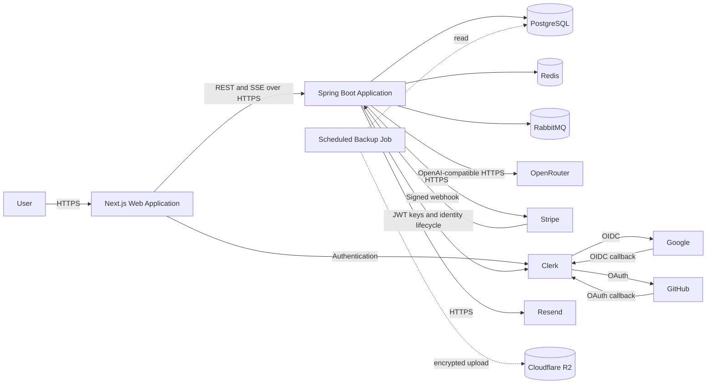
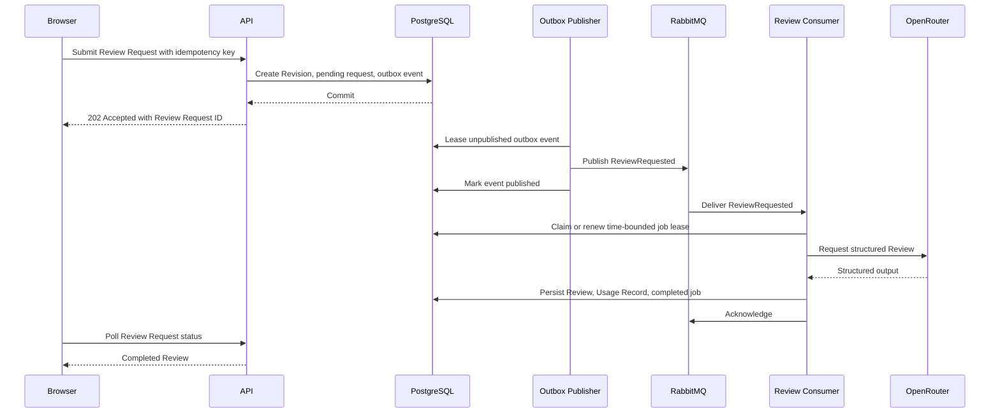

# System Design Copilot Architecture

| Field   | Value                              |
| ------- | ---------------------------------- |
| Status  | Target architecture for phased MVP |
| Version | 1.1                                |
| Date    | 2026-08-04                         |

## 1. Purpose

This document describes the current target architecture for the requirements in `docs/product/PRD.md`. Consequential decisions are recorded in `docs/adr/`; this document explains how those decisions work together.

## 2. Constraints And Drivers

- Deliver an end-to-end practice experience with a small operating budget.
- Keep security, ownership, entitlement, and AI policy in the backend.
- Preserve durable user and job state through managed-service interruption.
- Support interactive canvas editing and longer-running AI Reviews.
- Avoid premature microservices and independent operational surfaces.
- Keep the frontend contract synchronized with the backend.
- Make AI provider and model choices configurable.
- Respect free-tier connection, memory, compute, queue, and request limits.

## 3. System Context



The browser communicates only with the Next.js application and Spring Boot API. It never receives provider secrets or direct access to infrastructure services.

## 4. Deployment Containers

| Container               | Responsibility                                                                              | Hosted service |
| ----------------------- | ------------------------------------------------------------------------------------------- | -------------- |
| Next.js web             | Pages, interactive workspace, canvas, forms, API client                                     | Vercel         |
| Spring Boot application | REST API, security, business policy, AI orchestration, outbox publisher, RabbitMQ consumers | Northflank     |
| PostgreSQL              | Durable source of truth                                                                     | Neon           |
| Redis                   | Disposable caching, rate limits, short coordination                                         | Upstash        |
| RabbitMQ                | Asynchronous delivery of Review work                                                        | CloudAMQP      |
| Object storage          | Encrypted independent PostgreSQL logical backups                                            | Cloudflare R2  |

The Spring Boot process initially runs HTTP traffic and background consumers together. Module and message boundaries allow the same application image to run in API-only or worker-only mode later if workload isolation becomes necessary.

## 5. Repository Structure

```text
/
├── frontend/web/            Next.js application
├── backend/api/             Spring Boot application
├── infra/                   deployment and infrastructure support
├── docs/                    product and architecture documentation
├── compose.yaml             local managed-service substitutes
├── CONTEXT.md               canonical product terms
└── AGENTS.md                cross-repository engineering guidance
```

The applications are independently built and deployed. A monorepo keeps the OpenAPI contract, documentation, and cross-application changes reviewable together.

## 6. Frontend Architecture

### 6.1 Responsibilities

- Render public product, pricing, authentication, dashboard, catalog, workspace, Review, and billing experiences.
- Use the repository-root `DESIGN.md` as the source of UI design intent, validate representative behavior in a browser prototype, then implement approved designs with Tailwind CSS and shadcn/ui primitives.
- Provide a responsive React Flow architecture editor.
- Validate forms and imports early for usability while treating backend validation as authoritative.
- Manage API cache, background job polling, editor draft state, and autosave feedback.
- Never decide ownership, Plan access, quota, or final document validity.

### 6.2 Application Shape

```text
frontend/web/
├── app/                     Next.js routes and layouts
├── components/              shared visual components
├── features/
│   ├── auth/                Clerk integration and API-token acquisition
│   ├── billing/
│   ├── challenges/
│   ├── dashboard/
│   ├── workspace/
│   └── reviews/
├── lib/
│   ├── api/                 generated contract types and fetch client
│   ├── auth/
│   └── validation/
├── test/                    unit and component test support
└── e2e/                     browser journeys
```

Feature folders own feature-specific components, query definitions, schemas, and tests. Shared visual primitives do not own business workflows.

### 6.3 State Model

| State                                                        | Owner                 |
| ------------------------------------------------------------ | --------------------- |
| Persisted user, catalog, Workspace, usage, and Review data   | TanStack Query        |
| Unsaved React Flow nodes, edges, selection, and editor tools | Zustand               |
| Active field values and validation                           | React Hook Form       |
| Local disclosure and interaction state                       | React component state |

The editor loads a server document into a fresh Zustand store keyed by Workspace. Autosave snapshots the current draft, sends the expected version, and updates the TanStack Query cache only after server acceptance. HTTP `409` puts the editor into an explicit conflict state.

### 6.4 API Contract

Springdoc produces OpenAPI. The frontend generates TypeScript types during a controlled contract update and commits the generated contract artifact if required by the selected generator. One API client handles:

- Clerk API-token acquisition and `Authorization` headers.
- Correlation identifiers.
- RFC 9457 error decoding.
- Abort signals and timeouts.
- JSON request and response handling.

Components and hooks consume feature API functions rather than constructing URLs directly.

## 7. Backend Architecture

### 7.1 Modular Monolith

```text
com.systemdesigncopilot
├── identity
├── billing
├── challenge
├── workspace
├── architecture
├── decision
├── copilot
├── review
├── progress
└── shared
```

Each feature can contain `api`, `application`, `domain`, and `infrastructure` packages when those boundaries are useful. Features expose application interfaces and do not reach into another feature's persistence repositories.

### 7.2 Module Responsibilities

| Module       | Responsibilities                                                                             |
| ------------ | -------------------------------------------------------------------------------------------- |
| Identity     | Users, credentials, verification, OIDC identities, sessions, refresh rotation                |
| Billing      | Stripe customers, subscriptions, Entitlements, webhook handling                              |
| Challenge    | Curated Challenge catalog and access policy                                                  |
| Workspace    | Workspace lifecycle, fixed Type, Source, ownership, Review Brief context, Requirements and Assumptions |
| Architecture | Working document, schema validation, optimistic saves, immutable Revisions, import/export    |
| Decision     | Recorded architectural choices and evidence links                                            |
| Copilot      | Context assembly, guidance prompts, streaming turns, AI usage                                |
| Review       | Review jobs, prompt orchestration, rubric, Findings, retries and comparison                  |
| Progress     | User activity and comparable Review trends                                                   |
| Shared       | Narrow technical primitives such as clocks, identifiers, error contracts, and outbox support |

Shared is not a dumping ground for feature business logic.

### 7.3 API Style

- Base path: `/api/v1`.
- JSON request and response bodies.
- RFC 9457 `ProblemDetail` errors with stable application error codes.
- Cursor pagination for potentially growing collections.
- Optimistic concurrency through a version field or ETag/If-Match contract.
- `202 Accepted` for asynchronous Review submission.
- Idempotency keys for Review submission, Checkout creation, and other costly retried commands.

Initial resource groups:

```text
/api/v1/auth/*
/api/v1/me
/api/v1/me/sessions
/api/v1/me/usage
/api/v1/challenges
/api/v1/workspaces
/api/v1/workspaces/{workspaceId}/requirements
/api/v1/workspaces/{workspaceId}/assumptions
/api/v1/workspaces/{workspaceId}/architecture
/api/v1/workspaces/{workspaceId}/decisions
/api/v1/workspaces/{workspaceId}/copilot/turns
/api/v1/workspaces/{workspaceId}/scenarios
/api/v1/workspaces/{workspaceId}/review-requests
/api/v1/review-requests/{reviewRequestId}
/api/v1/reviews/{reviewId}
/api/v1/billing/checkout
/api/v1/billing/portal
/api/v1/webhooks/stripe
```

## 8. Data Architecture

### 8.1 Durable Records

The initial relational model contains these conceptual tables:

| Area          | Records                                                                                                                  |
| ------------- | ------------------------------------------------------------------------------------------------------------------------ |
| Identity      | `users` with immutable Clerk user IDs; no product-managed credentials, verification, reset, OAuth, or refresh-token records |
| Billing       | `billing_customers`, `subscriptions`, `webhook_receipts`, `entitlement_overrides`                                        |
| Learning      | `challenges`, `challenge_scenarios`, `workspaces`, `requirements`, `assumptions`, `decisions`                            |
| Scenarios     | `workspace_scenarios`, `scenario_responses`                                                                              |
| Architecture  | `architecture_documents`, `architecture_revisions`                                                                       |
| Copilot       | `copilot_threads`, `copilot_messages`                                                                                    |
| Review        | `review_jobs`, `reviews`, `review_dimension_scores`, `review_findings`                                                   |
| Usage         | `usage_records`                                                                                                          |
| AI operations | `ai_call_attempts` with safe metadata and no raw provider payload by default                                             |
| Messaging     | `outbox_events`, `processed_messages`                                                                                    |

Exact table shape is established in forward Flyway migrations. User-owned tables include an owner or Workspace relationship that supports explicit ownership checks and useful indexes.

### 8.2 Architecture Document

The working Architecture Document is schema-versioned JSONB. Import and export use a versioned Import Package that contains portable design content only:

```json
{
  "format": "system-design-copilot",
  "schemaVersion": 1,
  "workspace": {
    "title": "Example system",
    "requirements": [],
    "assumptions": [],
    "decisions": [],
    "architecture": {
      "nodes": [],
      "edges": [],
      "groups": [],
      "viewport": {}
    }
  }
}
```

Nodes, edges, and evidence-bearing portable records use stable opaque identifiers. Server-managed ownership, billing, Usage Record, Review, provider, and audit fields are never accepted from import content. The database row separately stores Workspace ID, optimistic version, timestamps, and checksum where useful.

Architecture nodes use a stable vendor-neutral Component Type, editable label, bounded type-specific properties, optional provider metadata, and extensible metadata. Custom Components use the same document shape with a user-selected semantic icon and category. Architecture Boundaries are nested labeled containers rather than runtime nodes. Connections use stable Connection Intents plus protocol, data intent, communication style, and guarantees. The Canvas does not simulate packet delivery or runtime behavior.

### 8.3 Revisions

The working design state remains mutable. Review submission atomically creates an Architecture Revision containing:

- Architecture Document content and schema version.
- Relevant Requirements and Assumptions.
- Relevant Decisions.
- Completed Scenario context.

The Review references this immutable Architecture Revision. Autosaves do not create Revisions, avoiding an event-sourced history and unbounded write amplification.

### 8.4 Data Integrity

- UUIDs or another opaque globally unique identifier format are generated by trusted application code.
- Foreign keys enforce ownership graph integrity.
- Unique constraints enforce provider identity, Stripe event, idempotency, and message-processing keys.
- Usage quotas use transactional checks and durable Usage Records.
- Deletion uses explicit policies; database cascades are limited to well-understood aggregate ownership.
- Timestamps are stored in UTC.

## 9. Authentication And Authorization

### 9.1 Session Design

- Clerk owns email/password authentication, email verification, credential recovery, Google OAuth, GitHub OAuth, and browser session lifecycle.
- Public Free registration is enabled during the personal beta without a product Invitation record or invitation API. Clerk remains the identity authority; layered backend rate limits, quotas, concurrency caps, and spend controls protect sensitive operations.
- The frontend obtains a short-lived Clerk session JWT only to call the separately hosted Spring API and sends it in the `Authorization` header without persisting it in browser storage.
- Spring Security validates the token signature against Clerk's keys and validates issuer, audience, authorized party, expiry, and immutable subject before associating it with a product User.
- Clerk revokes current or all browser sessions. API JWTs expire within 10 minutes, bounding the effect of a token issued before revocation.
- A strict Content Security Policy and explicit CORS allowlist mitigate the XSS and cross-origin risks of this browser-to-API token flow.

### 9.2 Authorization

Controllers do not rely on User-provided owner identifiers. Application services load by resource ID and authenticated User, or perform an equivalent explicit ownership check. Plan and quota policies execute beside the protected use case.

Initial authorities are `USER` and `ADMIN`. Being an administrator does not automatically expose private Workspace content unless a separately documented support workflow requires and audits that access.

### 9.3 Credential And Identity Rules

- Credential, verification, password-reset, social-provider configuration, account linking, and authentication abuse protection remain entirely in Clerk.
- A product User is associated only with the immutable Clerk user ID from a validated API JWT, never an email address supplied by the client.
- The product stores no end-user password, verification token, reset token, OAuth client secret, or refresh token.
- The backend applies its own rate limits to product operations that can cause abuse or material cost.

### 9.4 Browser API Contract

- The frontend obtains a Clerk session JWT immediately before an API request and sends it as a bearer token without persisting it in browser storage.
- CORS allows only configured application origins and the `Authorization` header; browser API calls do not rely on application-managed credentials or CSRF tokens.
- The frontend serves a strict Content Security Policy. API token values are not logged, included in errors, or sent to any service other than the Spring API.

## 10. AI Architecture

### 10.1 Provider Port

Copilot and Review modules depend on application-owned interfaces. A Spring AI adapter configures OpenRouter's OpenAI-compatible endpoint. Provider configuration includes model, base URL, timeout, maximum tokens, budget class, and privacy-routing policy.

Model IDs are never embedded in domain logic. Separate configurable model profiles support short Copilot Turns and deeper Reviews. The initial Copilot default is `deepseek/deepseek-v4-flash-0731`; the initial Review default is `openai/gpt-5.6-luna`. Both dated IDs must be benchmarked against the product's structured-output and evidence-grounding requirements before launch.

### 10.2 Context Assembly

Context assembly:

1. Authorizes the User and Workspace.
2. Confirms current AI Processing Consent.
3. Selects only the fields needed for the operation.
4. Applies character, item, and token budgets.
5. Labels user content as untrusted data.
6. Includes stable evidence identifiers.
7. Records a prompt-template version.

Provider payloads never contain credentials, billing secrets, session data, or unrelated Workspace content. The application stores provider request IDs and safe attempt metadata, not raw request or response payloads by default.

### 10.3 Copilot Turns

Copilot Turns are short interactive operations. The backend can stream model output over SSE while retaining responsibility for provider access. A response becomes accepted and metered only after it passes basic validation and is durably persisted. Client disconnect and partial provider output have explicit outcomes.

### 10.4 Structured Reviews

Reviews require a structured schema matching the PRD Review output contract. The adapter parses into dedicated DTOs, validates score ranges, evidence identifiers, enum values, sizes, and required fields, then maps valid output into Review records.

Invalid output may receive one bounded repair attempt. It is never stored as a completed Review merely because it is valid JSON.

### 10.5 Cost Controls

- Per-operation token and context budgets.
- Per-User rate and concurrency limits.
- Monthly Plan quotas.
- The same operation-specific model profile applies to Free and Pro; Plan policy changes allowance and operational limits, not model quality or privacy routing.
- Global daily provider-spend threshold, set to USD 0.10 for the personal beta.
- Model-specific cost metadata and alerts.
- No automatic fallback or escalation to another model.
- OpenRouter routing requires `data_collection: "deny"` and disables provider fallback; unavailable eligible providers fail recoverably rather than weakening the privacy policy.
- Usage recorded only according to the PRD's accepted/completed semantics.

## 11. Asynchronous Review Processing

### 11.1 Submission



### 11.2 Queue Policy

- Durable queue and persistent messages.
- Message contains IDs and versions, not the private architecture payload.
- Low initial consumer concurrency to respect AI and free-tier limits.
- Bounded retries for transient failures.
- Dead-letter exchange and queue for exhausted or non-retryable failures.
- Message and application correlation identifiers.
- Explicit maximum message age so obsolete work is not processed indefinitely.
- Outbox publication uses a reclaimable lease and marks an event published only after broker confirmation; a crash may duplicate delivery but cannot permanently strand the event.

PostgreSQL is the source of job state. RabbitMQ delivery is at least once, so a consumer claims a renewable, time-bounded lease using worker ID and lease expiry. A redelivery may reclaim an expired lease after a crashed worker. The consumer acknowledges only after the job is completed, terminal, or already terminal from a prior delivery; it never acknowledges merely because another non-expired worker currently owns the lease.

### 11.3 Retry And Usage Semantics

A Review Request targets one Architecture Revision and has one or more internal attempts. Automatic retries and a User retry of `failed-retryable` reuse that Request and Revision. A new Revision requires a new Review Request. Provider attempts always create safe operational cost metadata, while monthly product usage is recorded exactly once when the Review completes. Usage belongs to the UTC month containing `completed_at`.

## 12. Redis Usage

Redis may store:

- Rate-limit counters.
- Short-lived Challenge catalog cache.
- Short-lived coordination locks where database locking is unsuitable.
- Disposable provider-health or configuration cache.

The application remains correct after Redis eviction or restart. Durable quota, identity, billing, Review, and usage facts stay in PostgreSQL.

## 13. Billing Architecture

- The API creates Stripe Checkout and Customer Portal sessions for the authenticated User.
- Stripe redirects never directly grant Entitlements.
- The webhook endpoint verifies the signature against the raw request body.
- `webhook_receipts` makes event handling idempotent.
- Local subscription records form the application projection of Stripe payment state.
- Entitlement evaluation combines the Plan projection, configured Plan rules, and narrowly controlled overrides.
- Webhook order is handled by Stripe object/event time and fresh object retrieval when needed.
- Downgrade preserves content and applies the read/archive behavior in `BILL-007`.
- `trialing` and `active` grant Pro. `past_due` grants a configurable 7-day grace period. `incomplete`, `incomplete_expired`, `unpaid`, and `paused` grant Free. A scheduled cancellation retains Pro only through the paid-through timestamp.

## 14. Email Architecture

An application-owned mail port supports product notifications such as Account Deletion Request cancellation links. Clerk owns verification and password-reset email. The registration slice does not require Mailpit; a production notification adapter is introduced before the first product email. Email jobs may begin synchronously for the walking skeleton but should become retryable asynchronous work before launch if provider latency affects reliability.

Email links use random one-time tokens, short expiration, an allowlisted application base URL, and generic request responses.

### 14.1 Account Deletion

An Account Deletion Request is a durable scheduled workflow rather than a request-thread cascade. It requires fresh managed-identity authentication, revokes all Clerk sessions, suspends product access, cancels subscription renewal, records a 7-day recovery deadline, and sends a cancellation link. The link requires Clerk authentication and can only cancel the pending request. After the deadline, an idempotent worker writes a pseudonymous permanent-deletion tombstone to a create-only ledger outside PostgreSQL, deletes the Clerk User, and then removes private product content and identity data. Tombstones contain only User ID and deletion time, are retained for at least 70 days, and are replayed before access resumes after any disaster restore. This covers every still-retained 35-day backup. Restricted billing, fraud, or security records follow the PRD retention rules.

## 15. Observability

### 15.1 Logs

Structured logs include timestamp, level, service version, environment, request or job correlation ID, route or message type, outcome, and safe resource identifiers. Logs exclude secrets and full private architecture or conversation content.

### 15.2 Metrics

- HTTP request count, latency, status, and active requests.
- Authentication failure and rate-limit count.
- Database pool utilization and migration status.
- Outbox backlog and publish failures.
- Queue depth, consumer activity, retry count, and dead-letter count.
- AI requests, latency, outcome, model, token usage, and estimated cost.
- Review Request age by state.
- Stripe webhook success, lag, and failure.
- Last successful backup age, backup duration and size, checksum outcome, and restore-drill result.

### 15.3 Health

- Liveness reports whether the process can serve.
- Readiness reports whether required dependencies permit safe traffic.
- A degraded optional dependency such as Redis should not necessarily fail liveness.
- Health details exposed publicly must not reveal credentials or internal topology.

## 16. Local Development

Next.js and Spring Boot run on the host for fast reload. `compose.yaml` grows only when a milestone introduces behavior that uses a local service:

| Service      | First required by                     | Default development access               |
| ------------ | ------------------------------------- | ---------------------------------------- |
| PostgreSQL   | Identity persistence                  | database on `5433`                       |
| Redis        | Authentication rate limits            | protocol on `6379`                       |
| RedisInsight | Authentication rate limits            | UI on `5540`                             |
| RabbitMQ     | Asynchronous Review processing        | AMQP on `5672`, Management UI on `15672` |

Local credentials are development-only and configurable. Each added container image is pinned and has health checks and a named volume. Provider integration tests use fakes where practical; Google, GitHub, Stripe, and Resend sandbox checks may use a documented temporary HTTPS tunnel to the host-run application. No frontend or backend application is hosted before launch hardening.

## 17. Hosted Deployment

Hosted deployment occurs only in Milestone 8 after all feature slices pass their local quality gates. The first hosted release is a personal beta on Vercel Hobby, restricts participants to the Free Plan for real billing, and uses Stripe test mode only; it cannot collect real payments. When test-mode Pro is enabled, authenticated beta users may exercise Checkout and webhook activation without real charges; an optional synthetic Clerk subject can still narrow access in local or staging environments. A later commercial launch migrates the frontend to a commercial-eligible host or plan, first deploys the integrated application to a production-like staging environment, passes browser, provider, operational, and recovery checks there, then promotes the verified release to production. Public URLs and verification dates are recorded without credentials or private dashboard links.

### 17.1 Frontend

Vercel builds `frontend/web/` with npm and a committed `package-lock.json`. Staging and production use separate environment configuration; public environment variables contain only browser-safe API and product configuration.

### 17.2 Backend

Northflank builds a container from `backend/api/`. Runtime configuration comes from managed secrets. The process exposes Actuator health probes and performs controlled Flyway migration as part of release startup or a dedicated release step.

### 17.3 Managed Data Services

- Neon connection uses TLS and a pool size compatible with plan limits.
- Upstash connection uses TLS and bounded timeouts.
- CloudAMQP uses TLS, durable queues, and configured dead-letter routing. Its free development tier is limited to local development and private personal-beta validation; a paid broker plan is required before commercial launch.
- Provider regions should be selected to minimize unnecessary latency and cross-region data transfer.

### 17.4 Backup And Restore

- The personal beta is best-effort and disposable. It has no independent-backup, restore, RPO/RTO, or backup-deletion-tombstone guarantee; that limitation is disclosed to participants.
- Run a dedicated Northflank scheduled job every 12 hours to create a logical PostgreSQL backup and upload it to a private Cloudflare R2 bucket in an independently administered account. Retry transient failures three times with bounded backoff.
- Use a pinned backup image and `pg_dump` pipeline that compresses, encrypts before upload, creates a signed or authenticated manifest, and verifies checksums.
- Retain backup objects for 35 days and apply bucket lifecycle deletion.
- Give the job only a create-only upload gateway credential. A small Cloudflare Worker holding the R2 write credential accepts unique timestamped object keys and rejects overwrite, read, list, and delete operations. Separate offline operator credentials perform restore and lifecycle administration.
- Encrypt with a versioned `age` public key available to the job. Store private keys in an operator-controlled password manager plus an encrypted offline recovery copy, never in Northflank or the upload Worker. Record the key ID in each manifest and retain old private keys until every matching backup expires.
- Store permanent-deletion tombstones through a separate create-only Worker route or bucket prefix. The backup job cannot read, replace, or delete them.
- Use Neon point-in-time recovery or branching for fast operational recovery when the selected Plan supports it; independent backups protect against a broader provider or account failure.
- Target an internal RPO of 24 hours and RTO of 8 hours for commercial production.
- Alert on scheduled-job failure and when the last verified backup is older than 18 hours, before the 24-hour RPO is breached.
- Perform and record a production-like restore, including private-key recovery and deletion-tombstone replay, before commercial launch and at least quarterly after launch.

### 17.5 Domain And Cookies

The recommended production layout is:

```text
https://app.<domain>    Vercel
https://api.<domain>    Northflank
```

CORS uses an explicit allowlist. Clerk session, social-login callback, Stripe redirect, and product-notification link configuration derive from validated canonical URLs.

## 18. Failure Behavior

| Failure                                    | Expected behavior                                                                                                            |
| ------------------------------------------ | ---------------------------------------------------------------------------------------------------------------------------- |
| PostgreSQL unavailable                     | Reject dependent traffic; do not claim successful writes                                                                     |
| Redis unavailable                          | Fall back or reject rate-sensitive operations safely; durable data remains intact                                            |
| RabbitMQ unavailable                       | Commit Review job and outbox event; return accepted only after durable state exists; publish later                           |
| OpenRouter timeout                         | Retry only within policy; retain retryable or final job state; never fabricate output                                        |
| No eligible privacy-preserving AI provider | Return a recoverable unavailable state; never relax consent or provider-routing policy                                        |
| Malformed AI output                        | Validate, optionally repair once, then fail safely                                                                           |
| Stripe webhook duplicate                   | Return success after idempotent no-op                                                                                        |
| Stripe webhook delayed                     | Retain current projection and reconcile when event arrives                                                                   |
| Notification-email provider unavailable    | Preserve the pending Account Deletion Request and retry notification delivery without exposing private content               |
| Stale autosave                             | Return conflict and preserve both server state and unsaved local draft                                                       |
| Duplicate RabbitMQ delivery                | Acknowledge terminal jobs; defer a delivery with an active lease; reclaim an expired lease without duplicate Review or usage |
| Worker crash while processing              | Lease expires, the message is redelivered or recovered, and another worker safely reclaims the job                           |
| Accidental database deletion or corruption | Restore from Neon recovery features or encrypted R2 backup within internal RPO/RTO targets                                   |

## 19. Testing Strategy

### 19.1 Frontend

- Vitest and Testing Library for UI behavior, schemas, editor actions, and query states.
- Contract fixtures generated from or checked against OpenAPI.
- Playwright for authentication, workspace creation, autosave conflict, import, Review, quota, and billing boundaries.
- Targeted Playwright screenshot checks for stable public pages and core UI states; visual assertions exclude the dynamic architecture canvas.

### 19.2 Backend

- Unit tests for policy and domain behavior.
- Spring MVC and Security integration tests for transport and authorization.
- Testcontainers for PostgreSQL, Redis, and RabbitMQ.
- Fake OpenAI-compatible, Stripe, Google, GitHub, and Resend HTTP services.
- Migration tests from an empty schema and the last released schema.
- Duplicate delivery, rollback, retry exhaustion, webhook replay, and quota-race tests.

### 19.3 Infrastructure

- `docker compose config` validation.
- Container health and connection smoke tests.
- Deployed health and end-to-end smoke tests.
- Recovery exercises for failed migration, dead-letter messages, and provider outage.

## 20. Decision References

- `ADR-0001`: monorepo.
- `ADR-0002`: modular monolith.
- `ADR-0003`: JSONB document and immutable Revisions.
- `ADR-0004`: backend-owned cookie authentication (superseded by ADR-0009).
- `ADR-0005`: RabbitMQ, transactional outbox, and idempotent Review consumers.
- `ADR-0006`: evidence-grounded provider-agnostic AI.
- `ADR-0007`: Stripe-backed Entitlements.
- `ADR-0008`: low-cost managed deployment topology.
- `ADR-0009`: Clerk-managed authentication.
- `ADR-0010`: Clerk session JWT API authorization.
- `ADR-0011`: AI Processing Consent and non-retaining provider routing.
